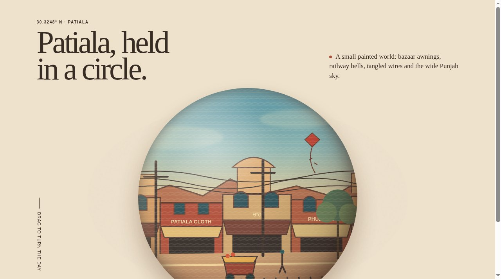

# Patiala, held in a circle

A small painted world of everyday Patiala, Punjab, wrapped around a sphere.



**Live:** https://aeiouvcode.github.io/patiala-flatball/

## About

Bazaar awnings, railway bells, tangled wires and the wide Punjab sky, painted from memory and map fragments. Drag to turn the day from Qila road through Adalat bazaar to the crossing, and press Listen for the sound of the street.

## Built with

Three.js (vendored), an SVG panorama and Web Audio. No build step.

## Run locally

```sh
git clone https://github.com/aeiouvcode/patiala-flatball.git
cd patiala-flatball
python3 -m http.server 8000
```

Then open http://localhost:8000.

## Layout

```
index.html            page shell
app.js                scene and interaction
style.css             styles
panorama.svg          painted panorama
three.module.min.js   Three.js
docs/                 README assets
```
